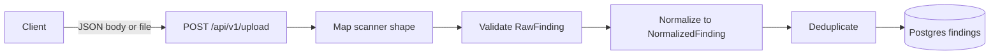
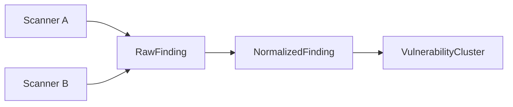

# Helion data flow

High-level flow of vulnerability finding data from scanners into normalized and clustered representations.

## Upload flow

- **POST /api/v1/upload**: Accepts SAST/SCA findings as `application/json` (single object or array) or as `multipart/form-data` with a `.json` file. Each item is first run through a **scanner mapper** (Trivy/Snyk/Semgrep heuristics or generic aliases) so that different field names map to RawFinding. Items are then validated as RawFinding, **normalized** to NormalizedFinding (severity standardized via aliases/numeric/CVSS; CVE/GHSA extracted from id, description, or payload when not already present), **deduplicated** per request by canonical key `(vulnerability_id, repo, file_path, dependency)`, and persisted to the `findings` table.

## Finding schemas flow

- **RawFinding**: Scanner-agnostic ingestion; all fields optional so different scanners can be accepted. Optional `scanner_source` and `raw_payload` for traceability. Incoming payloads are mapped to this shape via scanner mappers before validation.
- **NormalizedFinding**: Unified internal representation; same seven fields with strict types and validation regardless of scanner. The normalizer standardizes severity (aliases, numeric, CVSS fallback) and extracts CVE/GHSA identifiers from text when needed. Deduplication is applied per request before persist.
- **VulnerabilityCluster**: One logical vulnerability (e.g. one CVE) grouped across multiple occurrences; canonical fields plus `finding_ids` referencing normalized findings.

## Shared field set

All three schemas use the same core fields: `vulnerability_id`, `severity`, `repo`, `file_path`, `dependency`, `cvss_score`, `description`.
