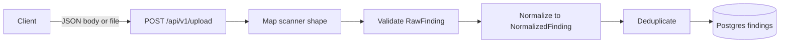
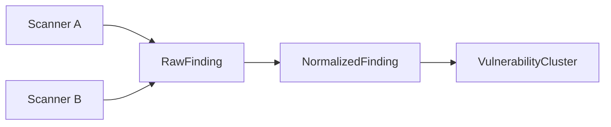
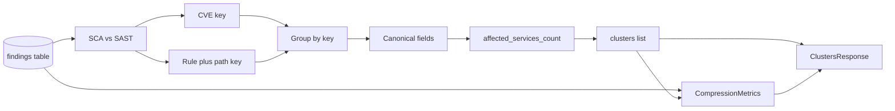
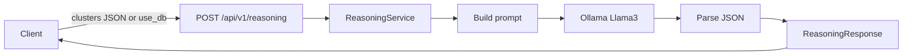
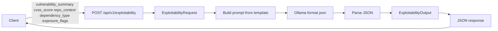

# Helion data flow

High-level flow of vulnerability finding data from scanners into normalized and clustered representations.

## Upload flow

- **POST /api/v1/upload**: Accepts SAST/SCA findings as `application/json` (single object or array) or as `multipart/form-data` with a `.json` file. Each item is first run through a **scanner mapper** (Trivy/Snyk/Semgrep heuristics or generic aliases) so that different field names map to RawFinding. Items are then validated as RawFinding, **normalized** to NormalizedFinding (severity standardized via aliases/numeric/CVSS; CVE/GHSA extracted from id, description, or payload when not already present), **deduplicated** per request by canonical key `(vulnerability_id, repo, file_path, dependency)`, and persisted to the `findings` table.

## Finding schemas flow

- **RawFinding**: Scanner-agnostic ingestion; all fields optional so different scanners can be accepted. Optional `scanner_source` and `raw_payload` for traceability. Incoming payloads are mapped to this shape via scanner mappers before validation.
- **NormalizedFinding**: Unified internal representation; same seven fields with strict types and validation regardless of scanner. The normalizer standardizes severity (aliases, numeric, CVSS fallback) and extracts CVE/GHSA identifiers from text when needed. Deduplication is applied per request before persist.
- **VulnerabilityCluster**: One logical vulnerability (e.g. one CVE) grouped across multiple occurrences; canonical fields plus `finding_ids`, `affected_services_count` (distinct repos), and `finding_count`.

## Clusters view

- **GET /api/v1/clusters**: Reads all rows from the `findings` table, runs the **clustering engine** (see below), and returns a **ClustersResponse** containing `clusters` (list of `VulnerabilityCluster`) and `metrics` (CompressionMetrics). No persistence of clusters; computed at read time. Metrics are derived from `len(findings)` and `len(clusters)`: `raw_finding_count`, `cluster_count`, and `compression_ratio` (raw_finding_count / cluster_count, or 0 when there are no clusters).
- **Cluster keys**: Findings are classified by `vulnerability_id`. If it matches CVE or GHSA (regex), the finding is **SCA** and the cluster key is `(vulnerability_id, dependency)` so the same CVE in different packages (e.g. lodash vs openssl) are separate clusters. Otherwise the finding is **SAST** and the cluster key is `(vulnerability_id, file_path_pattern)` where the path pattern is the normalized relative path (repo prefix stripped, slashes normalized).
- **Canonical repo**: When a cluster spans more than one repository, `repo` is set to `"multiple"` to avoid implying a single repo; when `affected_services_count` is 1, `repo` is that repository.
- **affected_services_count**: For each cluster, the number of distinct repositories (repos) that have at least one finding in that cluster. There is no separate “service” entity; repo is the service/repository dimension.

## Shared field set

All three schemas use the same core fields: `vulnerability_id`, `severity`, `repo`, `file_path`, `dependency`, `cvss_score`, `description`.

## Reasoning flow

- **POST /api/v1/reasoning**: Input is a list of `VulnerabilityCluster` in the request body, or `use_db: true` to load current clusters from the database (same as GET /clusters). The **ReasoningService** builds a prompt with the cluster data, sends it to the local LLM (Ollama with Llama 3) via `POST {OLLAMA_BASE_URL}/api/generate` with `format: "json"`. The model returns a single JSON object; the service parses it into **ReasoningResponse** (summary + cluster_notes with vulnerability_id, priority, reasoning) and returns it to the client.
- **Backend usage**: Other code can call `run_reasoning(clusters, settings)` from `app.services.reasoning` with a list of `VulnerabilityCluster` and the app settings to get structured reasoning without going through the HTTP endpoint.

## Exploitability flow

- **POST /api/v1/exploitability**: Accepts **ExploitabilityRequest** (vulnerability_summary, cvss_score, repo_context, dependency_type, exposure_flags). The service builds a structured prompt from the template in `app.services.exploitability`, sends it to Ollama with `format: "json"`, parses and normalises the response (e.g. adjusted_risk_tier), validates it against **ExploitabilityOutput**, and returns `adjusted_risk_tier`, `reasoning`, and `recommended_action`. Deterministic output is encouraged via explicit schema in the prompt, Ollama JSON mode, and Pydantic validation (with optional normalisation of tier strings).
- **Backend usage**: Call `run_exploitability_reasoning(vulnerability_summary, cvss_score, repo_context, dependency_type, exposure_flags, settings)` from `app.services.exploitability` to get structured exploitability reasoning without using the HTTP endpoint.
