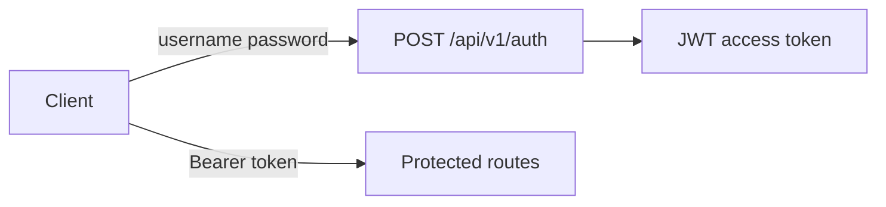
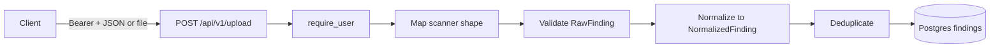
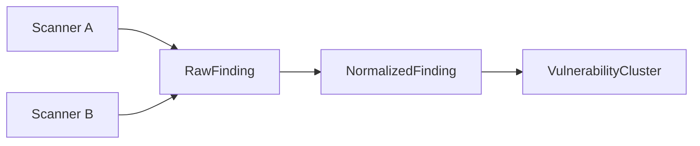
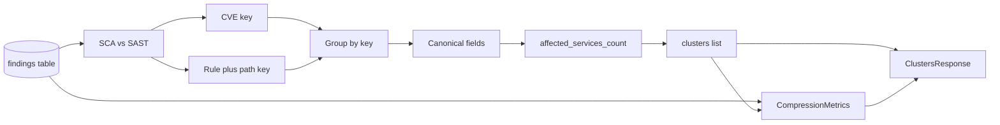
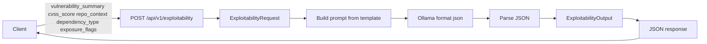
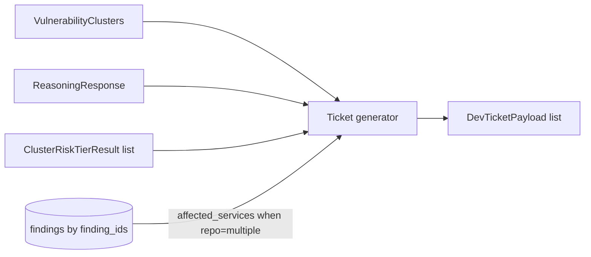
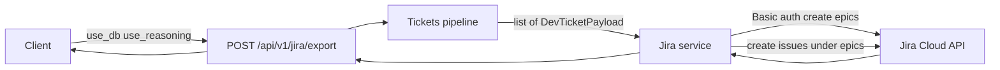

# Helion data flow

High-level flow of vulnerability finding data from scanners into normalized and clustered representations.

## Authentication and access control

- **POST /api/v1/auth**: Login with `username` and `password`. Returns a JWT **access_token**. Client must send `Authorization: Bearer <access_token>` on all protected endpoints.
- **Protected routes**: All v1 routes except **GET /api/v1/health** require a valid JWT. **get_current_user** dependency decodes the token and loads the user from the `users` table; missing or invalid token returns 401.
- **Role-based access**: Users have a **role** (`admin` or `user`). **require_admin** dependency restricts selected endpoints (e.g. **GET /api/v1/auth/users**) to `role === admin`; others get 403.
- **User creation**: No registration UI; create users via CLI or one-off script (see .env.example). Passwords are stored as bcrypt hashes only.

## Upload flow

- **POST /api/v1/upload**: Requires authentication. Accepts SAST/SCA findings as `application/json` (single object or array) or as `multipart/form-data` with a `.json` file. The **client** may be any HTTP client; when using the repo’s frontend, it is the **web upload page** (Next.js in `web/`, typically at http://localhost:3000), which sends the file via `multipart/form-data`. Each item is first run through a **scanner mapper** (Trivy/Snyk/Semgrep heuristics or generic aliases) so that different field names map to RawFinding. Items are then validated as RawFinding, **normalized** to NormalizedFinding (severity standardized via aliases/numeric/CVSS; CVE/GHSA extracted from id, description, or payload when not already present), **deduplicated** per request by canonical key `(vulnerability_id, repo, file_path, dependency)`, and persisted to the `findings` table.

## Finding schemas flow

- **RawFinding**: Scanner-agnostic ingestion; all fields optional so different scanners can be accepted. Optional `scanner_source` and `raw_payload` for traceability. Incoming payloads are mapped to this shape via scanner mappers before validation.
- **NormalizedFinding**: Unified internal representation; same seven fields with strict types and validation regardless of scanner. The normalizer standardizes severity (aliases, numeric, CVSS fallback) and extracts CVE/GHSA identifiers from text when needed. Deduplication is applied per request before persist.
- **VulnerabilityCluster**: One logical vulnerability (e.g. one CVE) grouped across multiple occurrences; canonical fields plus `finding_ids`, `affected_services_count` (distinct repos), and `finding_count`.

## Clusters view

- **GET /api/v1/clusters**: Reads all rows from the `findings` table, runs the **clustering engine** (see below), and returns a **ClustersResponse** containing `clusters` (list of `VulnerabilityCluster`) and `metrics` (CompressionMetrics). No persistence of clusters; computed at read time. Metrics are derived from `len(findings)` and `len(clusters)`: `raw_finding_count`, `cluster_count`, and `compression_ratio` (raw_finding_count / cluster_count, or 0 when there are no clusters).
- **Cluster keys**: Findings are classified by `vulnerability_id`. If it matches CVE or GHSA (regex), the finding is **SCA** and the cluster key is `(vulnerability_id, dependency)` so the same CVE in different packages (e.g. lodash vs openssl) are separate clusters. Otherwise the finding is **SAST** and the cluster key is `(vulnerability_id, file_path_pattern)` where the path pattern is the normalized relative path (repo prefix stripped, slashes normalized).
- **Canonical repo**: When a cluster spans more than one repository, `repo` is set to `"multiple"` to avoid implying a single repo; when `affected_services_count` is 1, `repo` is that repository.
- **affected_services_count**: For each cluster, the number of distinct repositories (repos) that have at least one finding in that cluster. There is no separate “service” entity; repo is the service/repository dimension.

## Data retention

- **Retention job** (run via `python -m app.retention` or manually): When **RETENTION_ENABLED** is true, deletes findings with `created_at < now() - RETENTION_HOURS` (default 48h). Logs how many were deleted. No cluster summary persistence; GET /clusters and metrics reflect current DB findings only.

## Shared field set

All three schemas use the same core fields: `vulnerability_id`, `severity`, `repo`, `file_path`, `dependency`, `cvss_score`, `description`.

## Reasoning flow

```mermaid
flowchart LR
  Client[Client]
  POST[POST /api/v1/reasoning]
  Reason[ReasoningService]
  Prompt[Build prompt]
  Ollama[Ollama Llama3]
  Parse[Parse JSON]
  Resp[ReasoningResponse]
  TierAssign[Risk tier assignment]
  Enriched[Enriched response]
  Client -->|"clusters JSON or use_db"| POST
  POST --> Reason
  Reason --> Prompt
  Prompt --> Ollama
  Ollama --> Parse
  Parse --> Resp
  Resp --> TierAssign
  TierAssign -->|"deterministic overrides"| Enriched
  Enriched --> Client
```

- **POST /api/v1/reasoning**: Input is a list of `VulnerabilityCluster` in the request body, or `use_db: true` to load current clusters from the database (same as GET /clusters). The **ReasoningService** builds a prompt with the cluster data, sends it to the local LLM (Ollama with Llama 3) via `POST {OLLAMA_BASE_URL}/api/generate` with `format: "json"`. The model returns a single JSON object; the service parses it into **ReasoningResponse** (summary + cluster_notes with vulnerability_id, priority, reasoning). **Risk tier assignment** (in `app.services.risk_tier`) then runs deterministically on clusters + reasoning: override rules (e.g. CVSS > 9 → Tier 1 unless dev-only) produce Tier 1/2/3 per cluster; the response is enriched with `assigned_tier` and `override_applied` on each cluster note. Final tier is AI-assisted, not AI-dependent.
- **Backend usage**: Other code can call `run_reasoning(clusters, settings)` from `app.services.reasoning` with a list of `VulnerabilityCluster` and the app settings to get structured reasoning without going through the HTTP endpoint. Use `assign_risk_tiers(clusters, reasoning_response=result, cluster_dev_only=...)` from `app.services.risk_tier` to compute tiers without the endpoint.

## Exploitability flow

- **POST /api/v1/exploitability**: Accepts **ExploitabilityRequest** (vulnerability_summary, cvss_score, repo_context, dependency_type, exposure_flags). The service builds a structured prompt from the template in `app.services.exploitability`, sends it to Ollama with `format: "json"`, parses and normalises the response (e.g. adjusted_risk_tier), validates it against **ExploitabilityOutput**, and returns `adjusted_risk_tier`, `reasoning`, and `recommended_action`. Deterministic output is encouraged via explicit schema in the prompt, Ollama JSON mode, and Pydantic validation (with optional normalisation of tier strings).
- **Backend usage**: Call `run_exploitability_reasoning(vulnerability_summary, cvss_score, repo_context, dependency_type, exposure_flags, settings)` from `app.services.exploitability` to get structured exploitability reasoning without using the HTTP endpoint.

## Ticket generation flow

- **POST /api/v1/tickets**: Accepts **TicketsRequest** (`clusters`, `use_db`, `use_reasoning`, optional `tier_overrides`). When `use_db` is true, clusters are loaded from the database (same as GET /clusters). When `use_reasoning` is true, the reasoning service and risk tier assignment run so each ticket gets LLM remediation and tier label. Optional `tier_overrides` is a map of `vulnerability_id` → `"Tier 1"` | `"Tier 2"` | `"Tier 3"` for consultant override of risk tier before export; when present, ticket generator applies these labels (and updated titles) after building payloads. The **ticket generator** (`app.services.ticket_generator`) converts each cluster into a **DevTicketPayload** with title, description, affected_services, acceptance_criteria, recommended_remediation, and risk_tier_label. For clusters with `repo == "multiple"`, distinct repos are resolved from the findings table by `finding_ids` and passed as affected_services. Response is **TicketsResponse** (`tickets`: list of DevTicketPayload), Jira-ready for manual creation or downstream integration.
- **Backend usage**: Call `cluster_to_ticket_payload(cluster, ...)` for a single cluster, or `clusters_to_ticket_payloads(clusters, notes_by_id=..., tier_by_id=..., affected_services_by_id=...)` for batch. Use `resolve_affected_services(session, finding_ids)` when `repo == "multiple"` to get distinct repo names from the DB.

## Jira export flow

- **POST /api/v1/jira/export**: Accepts **TicketsRequest** (same as POST /tickets: `clusters`, `use_db`, `use_reasoning`, optional `tier_overrides`). The server runs the same cluster and ticket pipeline as POST /tickets to produce a list of **DevTicketPayload**; when `tier_overrides` is provided, consultant-overridden tiers are applied before sending to Jira. The **Jira service** (`app.services.jira_export`) then creates one Jira epic per risk tier (Tier 1, Tier 2, Tier 3) in the configured project, and one Jira issue per ticket under the epic that matches the ticket’s `risk_tier_label`. Authentication uses Jira Cloud Basic auth (email + API token). Response is **JiraExportResponse** (`epics`: tier label → epic key, `issues`: created issue keys and titles, `errors`: any per-issue or epic errors for partial success). Requires JIRA_BASE_URL, JIRA_EMAIL, JIRA_API_TOKEN, JIRA_PROJECT_KEY; optional JIRA_EPIC_LINK_FIELD_ID for classic/company-managed projects (Epic Link custom field).
- **Backend usage**: Call `export_tickets_to_jira(tickets, settings)` from `app.services.jira_export` with a list of **DevTicketPayload** and app settings. Raises **JiraNotConfiguredError** if required Jira env is missing, **JiraApiError** on auth or API failures.

## Web UI (Next.js app in `web/`)

The Helion web app is a minimal UI that wires every OpenAPI endpoint to a small set of pages. State is local (React state/hooks); no component libraries. The **shared layout** provides a single **nav** (links to all pages) and **AuthTokenInput** (paste or persist JWT in `localStorage` under `helion_access_token`). The token is read with **getStoredToken()** from **web/lib/api.ts** and passed into **createApiClient({ token: getStoredToken() })**; the typed client sends `Authorization: Bearer <token>` on every request when a token is provided.

**Typed API client**: A central client layer lives in **web/lib/apiClient.ts**. It wraps `fetch` and exposes one typed function per endpoint (`getHealth`, `login`, `listUsers`, `uploadFindings`, `getClusters`, `postReasoning`, `postExploitability`, `postTickets`, `postJiraExport`). The client is created via `createApiClient({ baseUrl?, token? })`; it uses **getBaseUrl()** (re-export of `getApiBaseUrl()` from **web/lib/api.ts**) for the base URL (NEXT_PUBLIC_API_URL with localhost fallback) and, when `token` is provided, adds the Bearer header to every request. Request and response types are defined in **web/lib/types.ts** and aligned with the OpenAPI schemas; no hand-written fetch calls are required at the client layer.

### Route map (page → endpoint)

| Route | Page | API |
|-------|------|-----|
| `/` | Home | — (landing + nav) |
| `/health` | Health | **GET /api/v1/health/** |
| `/login` | Login | **POST /api/v1/auth** (stores token on success) |
| `/upload` | Upload | **POST /api/v1/upload** |
| `/results` | Results/Clusters | **GET /api/v1/clusters**; **POST /api/v1/jira/export** (Export to Jira button) |
| `/reasoning` | Reasoning | **POST /api/v1/reasoning** |
| `/exploitability` | Exploitability | **POST /api/v1/exploitability** |
| `/tickets` | Tickets preview | **POST /api/v1/tickets** |
| `/jira-export` | Jira export | **POST /api/v1/jira/export** |
| `/admin/users` | Admin users | **GET /api/v1/auth/users** (admin only) |

Pages call the API exclusively via the typed client (`createApiClient` from **web/lib/apiClient.ts**), passing an optional token from **getStoredToken()** (**web/lib/api.ts**). There are no direct `fetch`, `getApiBaseUrl`, or `getAuthHeaders` usages in page code. No dashboards or charts; forms and tables only.

## Results Summary (frontend)

The **Results** page (route `/results`) gives a read-only summary and one-click Jira export:

- On load it calls **GET /api/v1/clusters** and displays `metrics.raw_finding_count`, `metrics.cluster_count`, and a **risk tier breakdown** (count of clusters per severity: critical, high, medium, low, info) derived from the `clusters` array. No analytics or charts; a single summary table only.
- A **Manual tier override** toggle allows the consultant to change each cluster’s risk tier (Tier 1/2/3) before export; when enabled, a per-cluster tier selector is shown and the chosen tiers are sent as `tier_overrides` on export.
- The **Export to Jira** button calls **POST /api/v1/jira/export** with `use_db: true` and `use_reasoning: false` (and optional `tier_overrides` when manual override is used), triggering the same Jira export flow described above (tickets are created with tier labels from severity when reasoning is not used, or from `tier_overrides` when provided). Success and any `errors` from the response are shown to the user.
