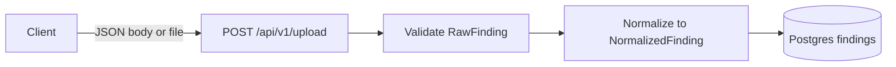
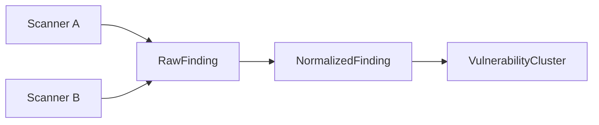

# Helion data flow

High-level flow of vulnerability finding data from scanners into normalized and clustered representations.

## Upload flow

- **POST /api/v1/upload**: Accepts SAST/SCA findings as `application/json` (single object or array) or as `multipart/form-data` with a `.json` file. Validates each item as RawFinding, normalizes to NormalizedFinding, and persists rows to the `findings` table.

## Finding schemas flow

- **RawFinding**: Scanner-agnostic ingestion; all fields optional so different scanners can be accepted. Optional `scanner_source` and `raw_payload` for traceability.
- **NormalizedFinding**: Unified internal representation; same seven fields with strict types and validation regardless of scanner.
- **VulnerabilityCluster**: One logical vulnerability (e.g. one CVE) grouped across multiple occurrences; canonical fields plus `finding_ids` referencing normalized findings.

## Shared field set

All three schemas use the same core fields: `vulnerability_id`, `severity`, `repo`, `file_path`, `dependency`, `cvss_score`, `description`.
