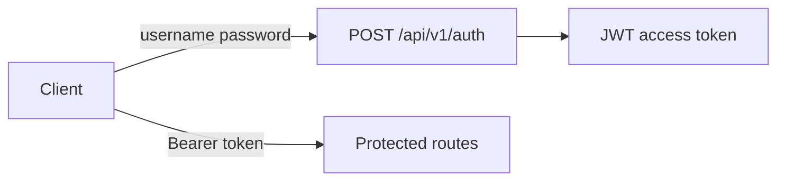
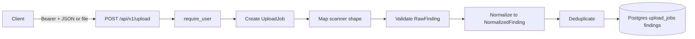
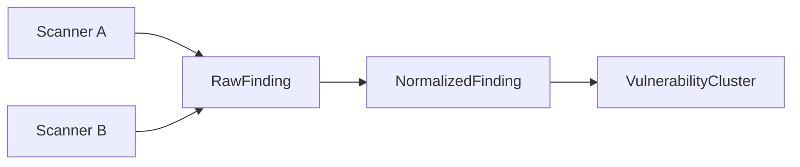
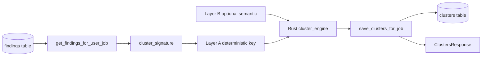
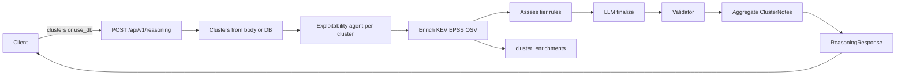
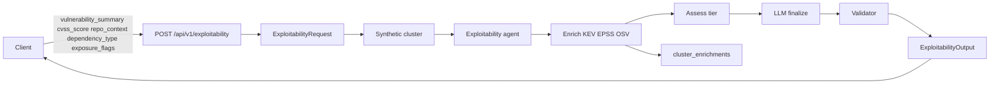
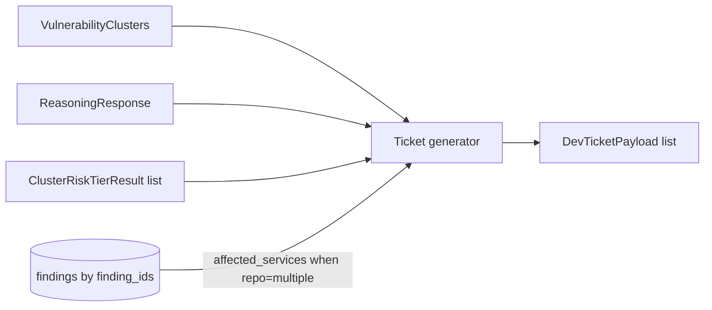
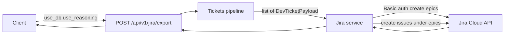

# Helion data flow

High-level flow of vulnerability finding data from scanners into normalized and clustered representations.

## Authentication and access control

```mermaid
flowchart LR
  Client[Client]
  Login[POST /api/v1/auth]
  JWT[JWT access token]
  Protected[Protected routes]
  Client -->|username password| Login
  Login --> JWT
  Client -->|"Bearer token"| Protected
```

- **POST /api/v1/auth**: Login with `username` and `password`. Returns a JWT **access_token**. Client must send `Authorization: Bearer <access_token>` on all protected endpoints.
- **Frontend token plumbing**: Token is stored and read via **web/lib/auth.ts** (`getToken`, `setToken`, `clearToken`, `getAuthHeaders`). **createApiClient()** calls `getToken()` so every request sends the Bearer header when a token exists. Login page calls `setToken(access_token)` on success. 401 responses are shown as an error message suggesting login; no automatic redirect.
- **Protected routes**: All v1 routes except **GET /api/v1/health** require a valid JWT. **get_current_user** dependency decodes the token and loads the user from the `users` table; missing or invalid token returns 401.
- **Role-based access**: Users have a **role** (`admin` or `user`). **require_admin** dependency restricts selected endpoints (e.g. **GET /api/v1/auth/users**) to `role === admin`; others get 403.
- **User creation**: No registration UI; create users via CLI or one-off script (see .env.example). Passwords are stored as bcrypt hashes only.

## Frontend: auth-required banner (401 / demo mode)

When any API call returns **401**, a global **auth-required banner** is shown on all pages (non-blocking): it displays “Auth required. Go to /login to get a token.” with a link to `/login`. The banner is driven by **web/lib/authBanner.ts** (`notify401`, `subscribeTo401`, `getHasSeen401`, `clearAuthBanner`). The API client (**web/lib/apiClient.ts**) calls `notify401()` on 401 responses; the **AuthRequiredBanner** component subscribes and shows the banner when the app has seen a 401 and the user has no token. The banner clears when the user saves a token in the header (AuthTokenInput calls `clearAuthBanner()`). There is no redirect or UI block; pages continue to handle errors locally (ErrorAlert, retry), and calls fail gracefully when unauthenticated.

## Frontend: global health badge

The Next.js root layout (`web/app/layout.tsx`) includes a global **environment/health badge** component that calls **GET /api/v1/health/** (unauthenticated) from the client. It displays the current **environment** (e.g. dev, prod) and **database** status (connected/disconnected) on every page as a fast sanity indicator.

## Upload flow and upload jobs

```mermaid
flowchart LR
  Client[Client]
  Upload[POST /api/v1/upload]
  Auth[require_user]
  CreateJob[Create UploadJob]
  Map[Map scanner shape]
  Validate[Validate RawFinding]
  Normalize[Normalize to NormalizedFinding]
  Dedupe[Deduplicate]
  DB[(Postgres upload_jobs findings)]
  Client -->|"Bearer + JSON or file"| Upload
  Upload --> Auth
  Auth --> CreateJob
  CreateJob --> Map
  Map --> Validate
  Validate --> Normalize
  Normalize --> Dedupe
  Dedupe --> DB
```

- **POST /api/v1/upload**: Requires authentication. Accepts SAST/SCA findings as `application/json` (single object or array) or as `multipart/form-data` with a `.json` file. The **client** may be any HTTP client; when using the repo’s frontend, it is the **web upload page** (Next.js in `web/`, typically at http://localhost:3000), which sends the file via `multipart/form-data`. If the payload is OSV-Scanner native JSON (top-level `results` array), it is flattened to one finding per (source, package, vulnerability) before mapping. Each item is then run through a **scanner mapper** (Trivy/Snyk/Semgrep/OSV-Scanner heuristics or generic aliases) so that different field names map to RawFinding. Items are then validated as RawFinding, **normalized** to NormalizedFinding (severity standardized via aliases/numeric/CVSS; CVE/GHSA extracted from id, description, or payload when not already present), **deduplicated** per request by canonical key `(vulnerability_id, repo, file_path, dependency)`, and persisted to the `findings` table with **upload_job_id** and **user_id**. Each upload creates an **upload_job**; response includes **upload_job_id**. **GET /api/v1/upload-jobs** lists jobs for the current user.

## Finding schemas flow

```mermaid
flowchart LR
  ScannerA[Scanner A]
  ScannerB[Scanner B]
  Raw[RawFinding]
  Norm[NormalizedFinding]
  Cluster[VulnerabilityCluster]
  ScannerA --> Raw
  ScannerB --> Raw
  Raw --> Norm
  Norm --> Cluster
```

- **RawFinding**: Scanner-agnostic ingestion; all fields optional so different scanners can be accepted. Optional `scanner_source` and `raw_payload` for traceability. Incoming payloads are mapped to this shape via scanner mappers before validation.
- **NormalizedFinding**: Unified internal representation; same seven fields with strict types and validation regardless of scanner. The normalizer standardizes severity (aliases, numeric, CVSS fallback) and extracts CVE/GHSA identifiers from text when needed. Deduplication is applied per request before persist.
- **VulnerabilityCluster**: One logical vulnerability (e.g. one CVE) grouped across multiple occurrences; canonical fields plus `finding_ids`, `affected_services_count` (distinct repos), and `finding_count`.

## Clusters view

```mermaid
flowchart LR
  DB[(findings table)]
  Load[get_findings_for_user_job]
  Sig[cluster_signature]
  LayerA[Layer A deterministic key]
  LayerB[Layer B optional semantic]
  Rust[Rust cluster_engine]
  Persist[save_clusters_for_job]
  ClustersTable[(clusters table)]
  Response[ClustersResponse]
  DB --> Load
  Load --> Sig
  Sig --> LayerA
  LayerB --> Rust
  LayerA --> Rust
  Rust --> Persist
  Persist --> ClustersTable
  Persist --> Response
```

- **GET /api/v1/clusters**: Optional query **job_id** scopes to that upload job (and current user). When the user has **more than one** upload job, **job_id** is required; if omitted, the API returns 422. Uses **get_or_build_clusters_for_job**: loads findings for the job, runs the clustering pipeline (Layer A + optional Layer B), **persists** results to the **clusters** table, and returns **ClustersResponse** (clusters + CompressionMetrics). The UI persists the selected job (e.g. in sessionStorage) so results stay stable across tabs and new uploads.
- **Persistence**: Cluster results are stored per **upload_job_id** in the **clusters** table. **Tickets**, **Reasoning**, and **Jira export** when **use_db=true** call **load_clusters_for_job** so they operate on the same snapshot the user saw on the Results page. If no rows exist for that job (e.g. legacy job), endpoints fall back to building clusters and persisting them.
- **Layer A (deterministic keys)**: **app/services/cluster_signature.py** produces a **deterministic_signature** per finding. **SCA**: key is `(vulnerability_id, ecosystem, package_name)`; ecosystem and package name are normalized from `raw_payload` when available (e.g. Trivy PURL, DataSource.ID; OSV-Scanner top-level `raw_payload.package_ecosystem` and `package.name`), so transitive trees collapse by same vuln + same package. **SAST**: key is `(rule_id, normalized_signature)` where the signature is derived from rule message + CWE from `raw_payload` (Semgrep-style); when `raw_payload` has no message/CWE, fallback is `(rule_id, file_path_pattern)`.
- **Layer B (optional semantic)**: When **CLUSTER_USE_SEMANTIC** and **QDRANT_URL** are set, **app/services/embeddings.py** and **app/services/qdrant_client.py** build text per finding (description + rule message + CWE), embed (optional sentence-transformers), upsert to Qdrant, and **search_similar_pairs** returns merge pairs; **app/services/semantic_merge.py** wires this into **build_clusters_v2**. Merge pairs are applied via union-find so findings above **CLUSTER_SIMILARITY_THRESHOLD** (and within **CLUSTER_TOP_K**) join the same cluster.
- **Clustering engine**: **app/services/clustering.py** exposes **build_clusters** (wrapper) and **build_clusters_v2** (Layer A + optional Layer B). When the optional **Rust** extension (`cluster_engine`) is installed, grouping runs in Rust; each finding is passed with optional **deterministic_signature** so the engine uses Layer A keys. Otherwise the Python implementation groups by the same signatures.
- **Canonical repo**: When a cluster spans more than one repository, `repo` is set to `"multiple"` to avoid implying a single repo; when `affected_services_count` is 1, `repo` is that repository.
- **affected_services_count**: For each cluster, the number of distinct repositories (repos) that have at least one finding in that cluster. There is no separate “service” entity; repo is the service/repository dimension.

## Semgrep rule analytics (SAST triage)

```mermaid
flowchart LR
  Findings[Findings for job]
  Summarize[summarize_rules]
  RuleSummary[RuleSummary]
  API[GET /clusters]
  UI[Results / Reasoning UI]
  Findings --> Summarize
  Summarize --> RuleSummary
  RuleSummary --> API
  API --> UI
```

- **Source**: The same findings used for clustering (returned by **get_or_build_clusters_for_job** as the third element of its tuple) are passed to **summarize_rules** in the clusters endpoint.
- **Flow**: **app/services/job_findings.py** defines **summarize_rules(findings)**. It filters to Semgrep findings (`scanner_source == "semgrep"`), groups by `vulnerability_id` (Semgrep rule id / check_id), and produces **RuleSummary**: **top_noisy_rules** (rules with highest finding count, capped at 20) and **rules_with_severity_disagreement** (rules that have more than one severity across findings, capped at 20).
- **Consumption**: **ClustersResponse** includes an optional **rule_summary** field. When the job has findings, the clusters endpoint sets **rule_summary** from **summarize_rules(findings)**; when there are no findings, **rule_summary** is null. The **Results** page and **Reasoning** page (when "Use current clusters from database" is selected and a job is chosen) display a "Top rules by volume" panel when **rule_summary** is present, showing the top noisy rules table and optionally the rules-with-severity-disagreement table. No ingestion UI changes; Semgrep JSON is already accepted via the existing upload flow.
- **Cluster behavior**: SAST clustering in **app/services/cluster_signature.py** already uses **extra.message** and **metadata.cwe** from Semgrep **raw_payload** in **_sast_signature_from_raw_payload()**, so the same rule + message + CWE across files merges into one cluster ("rule families"). No changes required for rule analytics.

## Data retention

- **Retention job** (run via `python -m app.retention` or manually): When **RETENTION_ENABLED** is true, deletes findings with `created_at < now() - RETENTION_HOURS` (default 48h). Logs how many were deleted. Cluster rows are tied to **upload_job_id** (CASCADE on job delete); GET /clusters recomputes and persists for the selected job when called.

## Shared field set

All three schemas use the same core fields: `vulnerability_id`, `severity`, `repo`, `file_path`, `dependency`, `cvss_score`, `description`.

## Tool integration

The pipeline is **tool-agnostic** after shape mapping: any scanner whose output can be mapped to RawFinding flows through normalize → dedupe → persist → cluster, and any enrichment source can attach evidence to clusters used by reasoning and tickets.

There are **two extension points** for integrating an open-source (or proprietary) tool:

1. **Mapper/parser into RawFinding** — So the tool’s JSON becomes findings that enter the pipeline.
   - **Where:** [app/services/scanner_mappers.py](app/services/scanner_mappers.py), function `normalize_shape_to_rawfinding()`.
   - **Contract:** Input is one scanner result object (dict). Output must be a dict with keys from `RAWFINDING_KEYS`: `vulnerability_id`, `severity`, `repo`, `file_path`, `dependency`, `cvss_score`, `description`, `scanner_source`, `raw_payload`. Preserve the original object in `raw_payload` and set `scanner_source` to a stable identifier (e.g. `"trivy"`, `"snyk"`). This dict is passed to `RawFinding.model_validate()` in the upload flow; no other code changes are required downstream.

2. **Enrichment provider** — So the tool’s data attaches evidence (and optionally structured fields) to clusters used by reasoning and ticket generation.
   - **Where:** [app/services/enrichment/](app/services/enrichment/): add a client module and call it from `enrich_cluster()` in [enrich_cluster.py](app/services/enrichment/enrich_cluster.py).
   - **Contract:** Input is a `VulnerabilityCluster` and app `Settings`. Output contributes to `ClusterEnrichmentPayload`: at minimum append short strings to `evidence` (e.g. `"KEV listed"`, `"EPSS 0.12"`). Optionally extend the payload schema in [schemas.py](app/services/enrichment/schemas.py) for structured data. Callers persist the returned dict via `save_cluster_enrichment()` to the `cluster_enrichments` table (JSONB).

For step-by-step checklists (new scanner vs new enrichment provider), see [docs/tool_integration.md](docs/tool_integration.md).

## Enrichment (KEV, EPSS, OSV)

- **Enrichment service** (`app/services/enrichment/`): For each cluster, the agent fetches **CISA KEV** (known exploited), **EPSS** (exploit probability), and **OSV** (advisory, fix versions, ecosystem). Results are stored in the **cluster_enrichments** table (JSONB) for traceability.
- **KEV**: HTTPS feed `https://www.cisa.gov/sites/default/files/feeds/known_exploited_vulnerabilities.json`; in-memory cache with TTL (**ENRICHMENT_KEV_CACHE_TTL_SEC**, default 3600). Lookup by CVE ID.
- **EPSS**: FIRST API `https://api.first.org/data/v1/epss?cve={id}`; returns probability 0–1 for CVE IDs.
- **OSV**: `https://api.osv.dev/v1/query` (package+version from dependency) or `GET /v1/vulns/{id}` for GHSA. Provides ecosystem, summary, fixed_in_versions.
- **Config**: **ENRICHMENT_KEV_ENABLED**, **ENRICHMENT_EPSS_ENABLED**, **ENRICHMENT_OSV_ENABLED** (default true); **ENRICHMENT_REQUEST_TIMEOUT_SEC** (default 15); **ENRICHMENT_KEV_CACHE_TTL_SEC** (default 3600). See `.env.example` for operator notes.

## Reasoning flow (grounded agent)

```mermaid
flowchart LR
  Client[Client]
  POST[POST /api/v1/reasoning]
  Clusters[Clusters from body or DB]
  Agent[Exploitability agent per cluster]
  Enrich[Enrich KEV EPSS OSV]
  Assess[Assess tier rules]
  LLM[LLM finalize]
  Validate[Validator]
  Store[cluster_enrichments]
  Aggregate[Aggregate ClusterNotes]
  Response[ReasoningResponse]
  Client -->|"clusters or use_db"| POST
  POST --> Clusters
  Clusters --> Agent
  Agent --> Enrich
  Enrich --> Store
  Enrich --> Assess
  Assess --> LLM
  LLM --> Validate
  Validate --> Aggregate
  Aggregate --> Response
  Response --> Client
```

- **POST /api/v1/reasoning**: Loads clusters (request body or DB with optional **job_id**). When use_db is true, clusters are loaded from the **clusters** table via **load_clusters_for_job** (same snapshot as Results); if none exist, they are built and persisted. For **each cluster** the **exploitability agent** runs: **Enrich** (KEV, EPSS, OSV) → **Assess** (rules-first suggested tier) → **LLM finalize** (Ollama with grounded prompt) → **Validator** (tier bounds: e.g. Tier 1 only with KEV or EPSS ≥ 0.1). Enrichment is persisted to **cluster_enrichments**. Responses are aggregated into **ReasoningResponse** (summary + cluster_notes with priority, reasoning, assigned_tier, and optional **kev**, **epss**, **fixed_in_versions**, **package_ecosystem**, **evidence**). Final tier is evidence-aware and defensible.
- **Backend usage**: Call `run_exploitability_agent(cluster, settings, session=..., upload_job_id=...)` from `app.services.agent` for a single cluster; the reasoning endpoint runs the agent per cluster and aggregates.
- **Reasoning page (web)**: Same as before: use_db or pasted clusters, notes table, "Use these notes for Tickets" stores **ReasoningResponse** in sessionStorage. Notes may now include grounded evidence fields when enrichment ran.

## Exploitability flow (grounded agent)

```mermaid
flowchart LR
  Client[Client]
  POST[POST /api/v1/exploitability]
  Req[ExploitabilityRequest]
  Synthetic[Synthetic cluster]
  Agent[Exploitability agent]
  Enrich[Enrich KEV EPSS OSV]
  Assess[Assess tier]
  LLM[LLM finalize]
  Validate[Validator]
  Store[cluster_enrichments]
  Out[ExploitabilityOutput]
  Client -->|"vulnerability_summary cvss_score repo_context dependency_type exposure_flags"| POST
  POST --> Req
  Req --> Synthetic
  Synthetic --> Agent
  Agent --> Enrich
  Enrich --> Store
  Enrich --> Assess
  Assess --> LLM
  LLM --> Validate
  Validate --> Out
  Out --> Client
```

- **POST /api/v1/exploitability**: Accepts **ExploitabilityRequest** (vulnerability_summary, cvss_score, repo_context, dependency_type, exposure_flags). The API builds a **synthetic cluster** (CVE extracted from summary when present), runs the **exploitability agent** (enrich → assess → LLM finalize → validate), persists enrichment to **cluster_enrichments**, and returns **ExploitabilityOutput** with `adjusted_risk_tier`, `reasoning`, `recommended_action`, and optional **kev**, **epss**, **fixed_in_versions**, **package_ecosystem**, **evidence**. Tier is constrained by validator (e.g. Tier 1 only with KEV or EPSS ≥ 0.1).
- **Backend usage**: Call `run_exploitability_agent(cluster, settings, session=..., persist_enrichment=True)` from `app.services.agent` with a **VulnerabilityCluster** (or synthetic cluster from request).

## Ticket generation flow

```mermaid
flowchart LR
  Clusters[VulnerabilityClusters]
  Reason[ReasoningResponse]
  Tier[ClusterRiskTierResult list]
  DB[(findings by finding_ids)]
  Gen[Ticket generator]
  Payloads[DevTicketPayload list]
  Clusters --> Gen
  Reason --> Gen
  Tier --> Gen
  DB -->|"affected_services when repo=multiple"| Gen
  Gen --> Payloads
```

- **POST /api/v1/tickets**: Accepts **TicketsRequest** (`clusters`, `use_db`, `use_reasoning`, optional `tier_overrides`, optional `reasoning_response`, optional **job_id**). When the user has more than one upload job, **job_id** is required when use_db is true; when omitted in that case, returns 422. When 0 or 1 job, job_id may be omitted. When **`reasoning_response`** is provided (e.g. from the Reasoning page via sessionStorage), the server uses it to build `notes_by_id` and `tier_by_id` and does not call the reasoning service; when absent and `use_reasoning` is true, the reasoning service and risk tier assignment run so each ticket gets LLM remediation and tier label. Optional `tier_overrides` is a map of `vulnerability_id` → `"Tier 1"` | `"Tier 2"` | `"Tier 3"` for consultant override of risk tier before export; when present, ticket generator applies these labels (and updated titles) after building payloads. The **ticket generator** (`app.services.ticket_generator`) converts each cluster into a **DevTicketPayload** with title, description, affected_services, acceptance_criteria, recommended_remediation, and risk_tier_label. When **cluster_note** includes **fixed_in_versions** or **evidence** (from grounded reasoning), those are appended to acceptance_criteria (e.g. "Upgrade to fixed version(s): X", "Evidence: KEV listed; EPSS 0.12"). For clusters with `repo == "multiple"`, distinct repos are resolved from the findings table by `finding_ids` and passed as affected_services. Response is **TicketsResponse** (`tickets`: list of DevTicketPayload), Jira-ready for manual creation or downstream integration.
- **Backend usage**: Call `cluster_to_ticket_payload(cluster, ...)` for a single cluster, or `clusters_to_ticket_payloads(clusters, notes_by_id=..., tier_by_id=..., affected_services_by_id=...)` for batch. Use `resolve_affected_services(session, finding_ids)` when `repo == "multiple"` to get distinct repo names from the DB.
- **Reasoning notes carry-forward**: The **Tickets** page (and **Jira export** when using the same request shape) reads **sessionStorage** for `REASONING_STORAGE_KEY` on load. If a valid **ReasoningResponse** is present (parsed and validated by **web/lib/reasoningStorage.ts** `parseStoredReasoningResponse`), the page shows a banner and a **"Use stored reasoning notes"** checkbox (default on). On submit with that option enabled, the client sends `reasoning_response` in the request and does not set `use_reasoning`; the server uses the stored notes for ticket generation. A **"Clear stored notes"** control removes the key from sessionStorage.
- **Tickets page (UI)**: The Tickets page supports use_db (default true), use_reasoning (default false), optional paste of clusters when use_db is false, optional tier overrides table when clusters are loaded, "Generate tickets" (POST /api/v1/tickets), preview of backlog (ticket cards), and "Copy JSON" for the request payload (see **Tickets (frontend)** below).

## Jira export flow

```mermaid
flowchart LR
  Client[Client]
  Export[POST /api/v1/jira/export]
  Tickets[Tickets pipeline]
  JiraSvc[Jira service]
  JiraAPI[Jira Cloud API]
  Client -->|"use_db use_reasoning"| Export
  Export --> Tickets
  Tickets -->|"list of DevTicketPayload"| JiraSvc
  JiraSvc -->|"Basic auth create epics"| JiraAPI
  JiraSvc -->|"create issues under epics"| JiraAPI
  JiraAPI --> JiraSvc
  JiraSvc --> Export
  Export --> Client
```

- **POST /api/v1/jira/export**: Accepts **TicketsRequest** (same as POST /tickets: `clusters`, `use_db`, `use_reasoning`, optional `tier_overrides`, optional `reasoning_response`, optional **job_id**). When the user has more than one upload job, **job_id** is required when use_db is true; when omitted in that case, returns 422. The server runs the same cluster and ticket pipeline as POST /tickets (including use of `reasoning_response` when provided) to produce a list of **DevTicketPayload**; when `tier_overrides` is provided, consultant-overridden tiers are applied before sending to Jira. The **Jira service** (`app.services.jira_export`) then creates one Jira epic per risk tier (Tier 1, Tier 2, Tier 3) in the configured project, and one Jira issue per ticket under the epic that matches the ticket’s `risk_tier_label`. Authentication uses Jira Cloud Basic auth (email + API token). Response is **JiraExportResponse** (`epics`: tier label → epic key, `issues`: created issue keys and titles, `errors`: any per-issue or epic errors for partial success). Requires JIRA_BASE_URL, JIRA_EMAIL, JIRA_API_TOKEN, JIRA_PROJECT_KEY; optional JIRA_EPIC_LINK_FIELD_ID for classic/company-managed projects (Epic Link custom field).
- **Backend usage**: Call `export_tickets_to_jira(tickets, settings)` from `app.services.jira_export` with a list of **DevTicketPayload** and app settings. Raises **JiraNotConfiguredError** if required Jira env is missing, **JiraApiError** on auth or API failures.

## Web UI (Next.js app in `web/`)

The Helion web app is a minimal UI that wires every OpenAPI endpoint to a small set of pages. State is local (React state/hooks); no component libraries. The **shared layout** provides a single **nav** (links to all pages) and **AuthTokenInput** (paste or persist JWT via **web/lib/auth.ts**).

**Token plumbing (web/lib/auth.ts)**: Single source of truth for the access token. **getToken()** / **setToken(token)** / **clearToken()** read and write the JWT in `localStorage` (key `helion_access_token`). **getAuthHeaders()** returns `{ Authorization: "Bearer <token>" }` when a token exists, else `{}`. All functions are SSR-safe. The login page calls **setToken(data.access_token)** after successful **POST /api/v1/auth**; AuthTokenInput uses **getToken** / **setToken** / **clearToken** for the paste-and-save UI.

**Typed API client**: A central client layer lives in **web/lib/apiClient.ts**. It wraps `fetch` and exposes one typed function per endpoint (`getHealth`, `login`, `listUsers`, `uploadFindings`, `getClusters`, `postReasoning`, `postExploitability`, `postTickets`, `postJiraExport`). The client is created via **createApiClient({ baseUrl?, token? })**; it uses **getBaseUrl()** (re-export of `getApiBaseUrl()` from **web/lib/api.ts**) for the base URL (NEXT_PUBLIC_API_URL with localhost fallback). When no `token` option is passed, the client uses **getToken()** from **web/lib/auth.ts**, so every request automatically includes `Authorization: Bearer <token>` when a token is stored. Request and response types are defined in **web/lib/types.ts** and aligned with the OpenAPI/backend schemas. **ReasoningRequest** requires `clusters` (array, may be empty) and `use_db` (boolean). **TicketsRequest** requires `clusters`, `use_db`, and `use_reasoning`; optional `tier_overrides` and `reasoning_response`. All UI call sites send these required fields explicitly (e.g. `clusters: []` when using DB) so the UI cannot drift from the backend contract. No hand-written fetch calls are required at the client layer.

**API error handling**: When a response is not ok (`!res.ok`), the client parses the body as JSON when `Content-Type` is `application/json`; if the JSON has a `detail` field (string or array of validation errors), that is used as the error message, otherwise `res.statusText` is used. For array `detail` (e.g. FastAPI 422), each item is formatted as `loc.join("."): msg` so the user sees which field failed. The client throws an **Error** whose `message` is that string and attaches `status` and `detail` (raw) for pages that need it. Pages use **getErrorMessage(err)** from **web/lib/apiClient.ts** in catch blocks to obtain a consistent user-facing string. **getValidationDetail(err)** returns the structured validation array when `status === 422` and `detail` is an array, for field-level display. For **401** responses, **getErrorMessage** returns **"Unauthorized. Please log in."** (no redirect; errors are shown and the user can navigate to `/login` if they choose).

**UI error display**: All user-facing API and validation errors are shown via the shared **ErrorAlert** component (**web/app/components/ErrorAlert.tsx**), which renders a `
` with a main message, an optional **detail** (string or list of validation errors with `loc` and `msg`), and an optional retry button. Every page that displays errors (upload, login, health, results, admin/users, jira-export, tickets, reasoning, exploitability) uses this component and passes **getValidationDetail(err)** as `detail` when available so **422** validation errors show server-provided field-level detail and the UI does not drift from the backend contract.

### Route map (page → endpoint)

| Route | Page | API |
|-------|------|-----|
| `/` | Home | — (landing + nav) |
| `/health` | Health | **GET /api/v1/health/** |
| `/login` | Login | **POST /api/v1/auth** (stores token on success) |
| `/upload` | Upload | **POST /api/v1/upload** |
| `/results` | Results/Clusters | **GET /api/v1/clusters**; **POST /api/v1/jira/export** (Export to Jira button) |
| `/reasoning` | Reasoning | **POST /api/v1/reasoning** |
| `/exploitability` | Exploitability | **GET /api/v1/clusters** (optional pre-fill); **POST /api/v1/exploitability** |
| `/tickets` | Tickets preview | **GET /api/v1/clusters** (when use_db); **POST /api/v1/tickets** |
| `/jira-export` | Jira export | **POST /api/v1/jira/export** |
| `/admin/users` | Admin users | **GET /api/v1/auth/users** (admin only) |

Pages call the API exclusively via the typed client (`createApiClient` from **web/lib/apiClient.ts**); the client reads the stored token via **getToken()** from **web/lib/auth.ts** when no token option is passed, so protected endpoints receive the Bearer token automatically. There are no direct `fetch`, `getApiBaseUrl`, or `getAuthHeaders` usages in page code. No dashboards or charts; forms and tables only.

## Results Summary (frontend)

The **Results** page (route `/results`) gives a read-only summary and one-click Jira export:

- On load it calls **GET /api/v1/clusters** and displays `metrics.raw_finding_count`, `metrics.cluster_count`, and a **risk tier breakdown** (count of clusters per severity: critical, high, medium, low, info) derived from the `clusters` array. No analytics or charts; a single summary table only.
- A **Manual tier override** toggle allows the consultant to change each cluster’s risk tier (Tier 1/2/3) before export; when enabled, a per-cluster tier selector is shown and the chosen tiers are sent as `tier_overrides` on export.
- The **Export to Jira** button calls **POST /api/v1/jira/export** with a **TicketsRequest** body: `clusters: []`, `use_db: true`, `use_reasoning: false`, and optional `tier_overrides` when manual override is used. This matches the backend contract; 422 validation errors are shown with server-provided detail via ErrorAlert. Success and any `errors` from the response are shown to the user.

## Exploitability (frontend)

The **Exploitability** page (route `/exploitability`) provides single-vulnerability exploitability reasoning for demos and ad-hoc assessment. On load it optionally calls **GET /api/v1/clusters** to populate a "Pre-fill from cluster" dropdown. The user can select a cluster and click **Load** to auto-fill vulnerability summary, CVSS score, repo context, and dependency type from that cluster (exposure flags are left empty). The user then submits the form to **POST /api/v1/exploitability** and sees `adjusted_risk_tier`, `reasoning`, and `recommended_action` in the response. If no clusters exist, a short message instructs the user to upload findings or fill the form manually.

## Tickets (frontend)

The **Tickets** page (route `/tickets`) shows backlog generation before Jira export. Controls: **use_db** (default true), **use_reasoning** (default false). When use_db is false, a "Paste clusters JSON" textarea appears; pasted input is validated with **web/lib/clusterValidation.ts** `parsePastedClusters` (ClustersResponse or raw clusters array, max 100 clusters). When clusters are loaded (from **GET /api/v1/clusters** when use_db is true, or from pasted JSON when use_db is false), an optional **tier overrides** table is shown (one row per vulnerability_id with a Tier 1/2/3 select; only selected overrides are sent). **"Generate tickets"** calls **POST /api/v1/tickets** with a **TicketsRequest** that always includes `clusters` (empty when use_db, else pasted clusters), `use_db`, and `use_reasoning`, plus optional `reasoning_response` and `tier_overrides`. The response is rendered as ticket preview cards (title, risk_tier_label, affected_services, recommended_remediation, acceptance_criteria). **"Copy JSON"** copies the last request payload to the clipboard for reuse (e.g. Jira export) or inspection. All pages that call reasoning, tickets, or Jira export handle 422 validation errors and show server-provided detail via **ErrorAlert** with **getValidationDetail(err)**.
